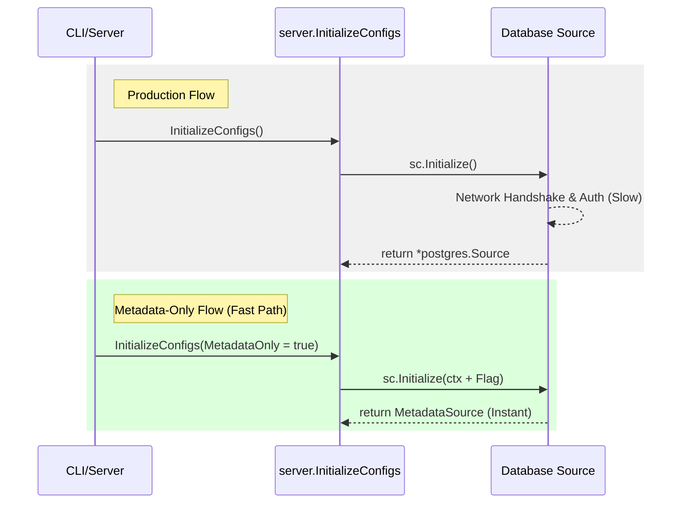

# Design Document: Fast, Maintainable Skill Generation via Centralized Initialization

## Problem Statement

The `skills-generate` command currently uses the production `InitializeConfigs` function, which performs a full, network-intensive initialization of all 40+ data sources (e.g., verifying database connectivity and credentials).

This is problematic for metadata-only tasks because:

- It is slow (latency-bound by network).
- It requires valid credentials and network access to every database in the config.
- It complicates CI/CD pipelines where database access is restricted.

## Investigation and Findings

A key goal was to avoid refactoring dozens of existing implementations of initialization functions. The investigation focused on how tools interact with sources and whether they require live connections during metadata extraction.

**Key Findings:**

1. **Implicit Interface Assertions:** All existing tools accept the global `sources.Source` interface during initialization. However, to execute database commands, they perform implicit interface assertions at runtime (via `tools.GetCompatibleSource[T]`) to check for specific methods like `RunSQL` or `GetDefaultProject`. They do not bind to concrete structs like `*postgres.Source`.
2. **Zero I/O during Discovery:** Crucially, tools perform **no I/O** (no database queries, no network calls) during their own `Initialize()` or `Manifest()` calls. Any dynamic data fetching happens strictly during `Invoke()`.

**Conclusion:** This confirms that we can safely mock the sources during the skill generation pass. By bypassing the expensive, network-heavy `Source.Initialize()` methods and supplying a lightweight "Metadata-Only" wrapper that implements the most common baseline methods, we can generate complete manifests without needing live database connections.

## Architecture Overview

The contrast between the production workflow and the metadata-only fast path is illustrated below:

# Proposed Design Options for Metadata Mode

Multiple architectural approaches have been identified to achieve fast, network-free skill generation. Each presents distinct trade-offs between implementation effort, maintenance burden, and architectural cleanliness. **No single solution is recommended as the definitive path forward.**

### Option 1: Centralized `MetadataSource` Wrapper

A single, shared struct in the `sources` package that implements the global `sources.Source` interface and common methods (like `GetDefaultProject()`). It returns errors for data-execution methods.

- **Deep Dive:** Investigation showed that ~90% of tools only require baseline methods or standard `RunSQL`/`Query` signatures. However, specialized tools perform interface assertions that this centralized struct cannot satisfy. For example, Spanner tools often expect `SpannerClient()`, and Cloud Healthcare tools expect `AllowedDICOMStores()`.
- **Pros:**
  - Lowest immediate engineering effort.
  - Reuses all native Toolbox parsing and validation logic.
- **Cons:**
  - Fails runtime interface assertions for specialized tools unless stubs are added manually.
  - Creates ongoing maintenance debt as new tools with new source method requirements are added.
- **Mitigation:** Can be combined with a **Soft Warning Fallback** in the CLI to skip tools that fail to initialize in metadata mode, preventing hard crashes during `skills-generate`.

### Option 2: Nil Pointer Embedding (Per-Source Wrappers)

Each database package defines a lightweight wrapper struct that embeds a pointer to the real source (e.g., `type SpannerMetadataSource struct { *spanner.Source }`).

- **Deep Dive:** In Go, embedding a pointer promotes all its methods. This allows the wrapper to statically satisfy all interfaces that the real source satisfies (solving the Spanner/DICOM assertion problem) without manually writing stubs. Overrides are only needed for methods actually called during initialization (like `GetDefaultProject`).
- **Pros:**
  - Statically inherits all methods of the real source via Go embedding, satisfying all dynamic interface assertions perfectly.
  - Zero maintenance when new execution methods are added to sources.
- **Cons:**
  - Requires adding boilerplate wrapper definitions to all 43 database packages.
  - Risk of nil pointer dereference panic if a tool attempts to call an execution method during discovery (though forbidden by Constraint 2).

### Option 3: Automated Code Generation for Mocks

A script run via `go generate` that uses Go's Abstract Syntax Tree (AST) parser to read database files and automatically generate the required stubs or wrappers.

- **Deep Dive:** The script scans `internal/sources/`, finds all public methods on source structs, and auto-generates a `metadata_generated.go` file with all the stubs returning `nil, ErrMetadataOnlyMode`.
- **Pros:**
  - Zero manual refactor of the 43 sources.
  - Zero ongoing maintenance of stubs.
  - Provides full interface coverage automatically.
- **Cons:**
  - Requires writing and maintaining a custom Go AST parsing script.

### Option 4: Lazy Connection Initialization

Modify sources to defer database connections until the first call to an execution method (e.g., `RunSQL`).

- **Deep Dive:** Uses `sync.Once` to ensure thread-safe, single-time initialization on demand.
- **Pros:**
  - The most idiomatic Go approach for managing heavy resources.
  - High execution fidelity; no "fake" objects needed.
- **Cons:**
  - Massive refactor requiring changes to the core initialization logic of all 43 database integrations.
- **Mitigation for Fail-Fast:** The concern that configuration errors are deferred can be solved by having the production server run an explicit `Ping()` on startup, while the CLI skips it.

### Option 5: Configuration-as-Data (Pure YAML Parsing)

Bypass the Go runtime entirely for skill generation. Use a script to read the raw `tools.yaml` file and extract manifests directly from the text.

- **Pros:**
  - Physically impossible to trigger database connections or network calls.
- **Cons:**
  - Replicates the complex parsing and default-value logic native to the Toolbox server, creating a duplicate maintenance burden.

### Option 6: Decoupling Manifests from Initialization

Add a `Manifest()` method to the `ToolConfig` interface so tools can report their schemas without needing to be initialized with a source.

- **Deep Dive:** Conflation of concerns currently exists because a tool cannot tell you what parameters it accepts unless you fully initialize it with a live (or mocked) database source.
- **Pros:**
  - Cleanest separation of concerns between documentation and execution.
- **Cons:**
  - Requires a breaking change to the core `ToolConfig` interface, forcing updates to every single tool implementation.

### Option 7: Per-Source Mocking

Manually implement a distinct mock for each of the 40+ database sources (e.g., `internal/sources/postgres/mock.go`).

- **Pros:**
  - Provides high fidelity and full interface satisfaction for each source.
- **Cons:**
  - Introduces an unacceptable maintenance burden. Every time a new database source is contributed, the author would be forced to write and maintain a corresponding mock.

## Constraints & Invariants

1. **Static Tool Manifests:** A Tool's `Manifest()` and `McpManifest()` methods **must be statically computable**. They cannot perform database queries to dynamically build their parameter lists.
   * *Applicability:* **All Options**. If manifests require live DB data, no static generation or lazy loading can make it fast.

2. **No I/O in Tool Initialize:** While Sources are expected to do I/O during initialization, **Tools are strictly forbidden** from doing so.
   * *Applicability:* **Options 1, 2, 3, 4, and 7**. Critical for any approach that executes the Go `Initialize()` sequence during metadata extraction.

3. **Interface Assertions Awareness:** Tools are permitted to use local interface assertions (e.g., `tools.GetCompatibleSource[T]`) rather than strict global interface adherence.
   * *Applicability:* **Options 1, 2, 3, and 7**. The mock/wrapper provided must account for these assertions to avoid runtime failures.
